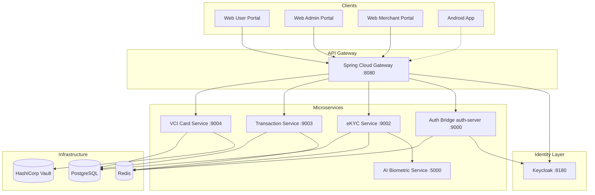
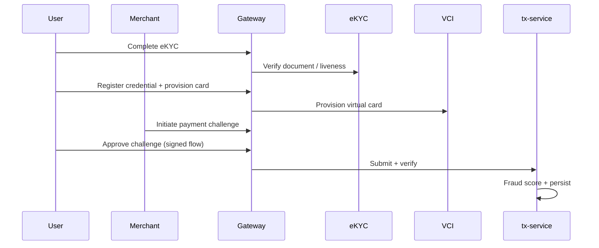

# UniTrust — System Architecture & Product Overview

*Presentation-oriented summary. Aligns with the implementation baseline in the Trust Layer plan (Phases 0–5, 7–9 complete; Android Phase 6 optional) and the detailed docs in this folder.*

---

## 1. Executive summary (one slide)

**UniTrust** is a multi-tenant platform that combines **OIDC identity (Keycloak)**, **AI-assisted eKYC**, **virtual card lifecycle (VCI)**, and **signed payment challenges** behind a single **API gateway**. It targets banks, fintechs, acquirers, and inclusion programs that need portable identity, biometric-aware authorization patterns, and clear auditability.

**Primary demo surface today:** three **web portals** (user, admin, merchant) plus containerized backend services. **Android** remains a documented extension path, not required for the core hackathon narrative.

**One-line value:** *Federated login, verified identity claims, tokenized card artifacts, and merchant-initiated transactions—with admin observability and compliance-oriented controls.*

---

## 2. Product narrative

### 2.1 Problem space

- Fragmented onboarding and KYC across channels.
- Weak binding between “who logged in” and “who approved a payment.”
- Need for tenant isolation, audit trails, and privacy-conscious claim sharing.

### 2.2 What the product does

| Capability | Outcome |
|------------|---------|
| SSO & consent | Keycloak-backed OIDC; sessions and consent aligned with enterprise IdP practice |
| eKYC + risk | Document-oriented verification with AI scoring; persisted risk for ops |
| Virtual cards | Provisioning, limits, freeze/unfreeze; PAN protection via Vault Transit (with fallback path) |
| Dynamic CVV | Time-based rotating CVV for demo of credential agility |
| Payments | Merchant-initiated challenges; user approval; fraud scoring; persisted history |
| Operations | Admin views for tenants, users, risk aggregates, audit logs |

### 2.3 Who it is for

From [business-deployment-model.md](business-deployment-model.md):

- Banks and digital banks  
- Fintech lenders  
- Merchant acquirers and payment facilitators  
- Government-backed inclusion programs  

---

## 3. User-facing surfaces (three portals)

| Portal | Role | Typical actions |
|--------|------|-----------------|
| **User** | `user` | Dashboard, identity/eKYC, cards, dynamic CVV, pending payment approval, sessions |
| **Admin** | `admin` | Tenants, users, risk summary, audit logs, user lifecycle |
| **Merchant** | `merchant` | Register/summary, create payment challenge (QR flow), history, reconciliation |

**Demo users** (local): `demo` / `demo`, `admin` / `admin`, `merchant` / `merchant` — see [demo-script.md](demo-script.md).

---

## 4. System architecture

### 4.1 Logical diagram (end state)

### 4.2 Layered view (talk track)

1. **Edge:** Browser clients talk to the **gateway** (JWT validation, routing, CORS). Frontend is served separately (e.g. nginx) with OIDC discovery proxied as needed.  
2. **Identity:** **Keycloak** is the OIDC authority; the **auth-server** module acts as an **Auth Bridge** (credentials, sessions orchestration, admin/tenant/identity APIs, WebSockets).  
3. **Domain services:** **eKYC** (verification + persistence), **VCI** (cards, merchants, Vault), **tx** (initiate, verify, fraud, history, reconciliation).  
4. **AI:** **FastAPI ai-service** supplies OCR, liveness, anti-spoof, and composite risk scoring for eKYC.  
5. **Data plane:** **PostgreSQL** for durable entities; **Redis** for pub/sub events and ephemeral coordination; **Vault** for tokenization/secrets patterns.

### 4.3 Service responsibilities (compact)

| Component | Responsibility |
|-----------|----------------|
| **Gateway** | Route `/api/*` to services; validate JWT issuer; cross-cutting policies |
| **Keycloak** | Realms, clients, roles (`user`, `admin`, `merchant`), consent, sessions |
| **Auth Bridge** | Resource server for Keycloak JWT; DPoP on high-assurance paths; credential registration; Redis → WebSocket bridge; tenant/branding; identity `/me`; admin APIs |
| **eKYC** | Document upload pipeline; calls AI service; persists claims/risk; publishes completion events |
| **VCI** | Card provision, limits, status, dynamic CVV; merchant registration; Vault for PAN ciphertext |
| **tx** | Payment challenge/initiation; signature verification; fraud scoring; persistence; merchant history/reconciliation |
| **AI service** | Heuristic OCR/liveness/spoof/risk endpoints (see [ai-model-documentation.md](ai-model-documentation.md)) |

### 4.4 Identity model (from docs)

- **OIDC:** Authorization Code + PKCE for web (and planned mobile).  
- **JWT:** Access tokens validated by gateway and services.  
- **DPoP:** Demonstrating Proof-of-Possession for token-bound requests on sensitive flows.  
- **Tenancy:** `tenants` + `tenant_id` on identities; branding via API.  
- **Sessions:** Keycloak is source of truth; Auth Bridge exposes list/revoke-style operations for the UI.  

Details: [identity-authentication-model.md](identity-authentication-model.md).

---

## 5. Core business flows

### 5.1 Card and transaction (summary)

Narrative steps: [card-transaction-flow.md](card-transaction-flow.md).

### 5.2 Event-driven UI refresh

- Redis channels such as `tl:events:ekyc_complete`, `tl:events:tx_approved`, etc.  
- Auth Bridge forwards to **STOMP** topics (e.g. `/topic/session/{sessionId}`) so portals can show near-real-time updates.

---

## 6. Data & security (presentation bullets)

### 6.1 Notable entities

- `tenants`, `user_identity` (including `keycloak_sub`, risk score)  
- `biometric_credential`, `virtual_card`  
- `transactions`, `merchants`  
- `audit_logs`  

### 6.2 Security & compliance story

- **STRIDE-oriented** threat framing and mapped controls: [security-compliance-framework.md](security-compliance-framework.md).  
- **Privacy:** minimization, masking, retention, selective disclosure: [privacy-controls.md](privacy-controls.md).  
- **Controls in scope:** JWT at boundaries, DPoP, signed transactions + nonce semantics, Vault-oriented tokenization, rate limiting, audit on state changes.

---

## 7. AI / eKYC

- The **ai-service** implements **document OCR confidence**, **liveness heuristics**, **anti-spoof proxies**, and a **weighted risk score** — documented as **heuristics**, not a production-grade deep model.  
- **Evaluation** is reproducible via `ai-service` scripts and a synthetic dataset; current baseline metrics in [ai-model-documentation.md](ai-model-documentation.md) show the stack is useful for **architecture and integration demos** while **threshold calibration** remains a pre-production task.  
- **eKYC service** can degrade to manual-review style responses if the AI service is unavailable (resilience story for slides).

---

## 8. Deployment model

- **Local / demo:** `docker compose` stack — Postgres, Redis, Keycloak, Vault, gateway, Java services, frontend, AI service.  
- **Production direction:** same logical topology, with hardened secrets, observability, and CI/CD (see plan “Mode B” — Kubernetes, monitoring).  

Reference: [business-deployment-model.md](business-deployment-model.md), repo `README` and [E2E-VALIDATION.md](E2E-VALIDATION.md).

---

## 9. Scope for the presentation

| In scope (baseline) | Out of scope / future |
|---------------------|------------------------|
| Web OIDC, three portals | Full Android app completion (Phase 6 optional) |
| Gateway, microservices, Flyway schema | Full offline mobile queue |
| eKYC + AI integration | Production ML calibration at scale |
| Vault tokenization path + fraud rules | Full SOC2/ISO certification artifacts |

---

## 10. Suggested slide outline (≈10–12 slides)

1. Title — Trust Layer: identity + payments trust fabric  
2. Problem — fragmented KYC, weak payment binding, multi-tenant needs  
3. Solution overview — one gateway, Keycloak, domain microservices  
4. Architecture diagram — section 4.1  
5. Identity & roles — Keycloak, JWT, DPoP (high level)  
6. eKYC & AI — pipeline diagram; “heuristics + integration” honesty  
7. Cards & Vault — tokenization + dynamic CVV  
8. Transactions — merchant challenge → user approve → fraud → persist  
9. Portals — user / admin / merchant screenshots or wireframe  
10. Security & privacy — STRIDE + audit + masking (one slide)  
11. Deployment — containers, data stores  
12. Demo / next steps — [demo-script.md](demo-script.md), Android as roadmap  

---

## 11. Demo close (30 seconds)

- Single command bring-up; Keycloak login; web eKYC upload; card provision and rotating CVV; merchant challenge and user approval; admin risk and audit.  
- Close with: *portable identity, token-bound APIs, and operational transparency — ready for pilot hardening.*

---

## 12. Document index

| Document | Use in deck |
|----------|-------------|
| [demo-script.md](demo-script.md) | Live demo script |
| [identity-authentication-model.md](identity-authentication-model.md) | Identity slide |
| [card-transaction-flow.md](card-transaction-flow.md) | Sequence / flow slide |
| [security-compliance-framework.md](security-compliance-framework.md) | Security slide |
| [privacy-controls.md](privacy-controls.md) | Privacy / GDPR-style talking points |
| [ai-model-documentation.md](ai-model-documentation.md) | AI limitations & metrics |
| [business-deployment-model.md](business-deployment-model.md) | GTM / deployment |
| [E2E-VALIDATION.md](E2E-VALIDATION.md) | QA / readiness checklist |

---

*This file is meant to be copied into slide decks or executive summaries. For engineering depth, use the linked docs and the repository implementation plan.*
