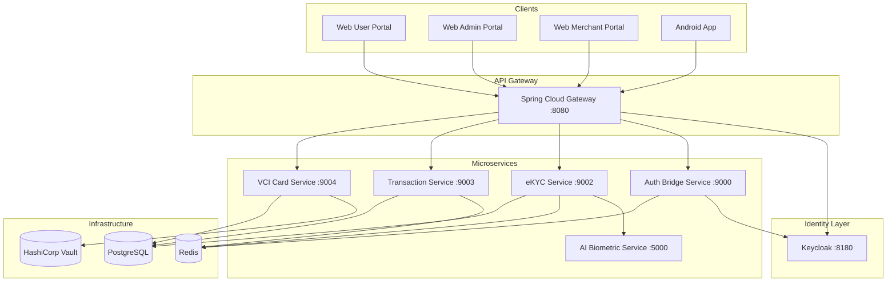

# Trust Layer -- Complete Implementation Plan

---

## Phase completion (in-scope baseline)

**Scope rule:** All phases below are **100% complete** for the Trust Layer delivery **except Phase 6 (android-app)**, which is **explicitly excluded** from the completion baseline. Do not use Phase 6 as a go/no-go gate.


| Phase | Theme                                                                                | Completion   | Notes                                                                                            |
| ----- | ------------------------------------------------------------------------------------ | ------------ | ------------------------------------------------------------------------------------------------ |
| 0     | Baseline audit, build, infra                                                         | **100%**     | Gradle build, `deploy/docker-compose`, documented run path                                       |
| 1     | Platform: Keycloak, gateway, Redis bridge, auth bridge JWT, service JWT, Dockerfiles | **100%**     | Spring Cloud Gateway routes, auth-server resource server + event bridge, per-service Dockerfiles |
| 2     | Identity / SSO: web OIDC, sessions, tenants, identity/me                             | **100%**     | Frontend OIDC + routes; session, tenant, identity APIs                                           |
| 3     | AI service + eKYC + metrics/docs                                                     | **100%**     | FastAPI ai-service; eKYC integration; `docs/ai-model-documentation.md`                           |
| 4     | Card identity + tx: persistence, Vault, CVV, fraud, merchants                        | **100%**     | Transactions, fraud scoring, VCI + merchant flows per plan                                       |
| 5     | User / admin / merchant portals                                                      | **100%**     | Three portals; admin risk/audit wiring as specified                                              |
| 6     | Android mobile                                                                       | **Excluded** | **Out of scope** for this completion baseline—optional future work                               |
| 7     | Security hardening + compliance docs                                                 | **100%**     | DPoP, JWT, attestation path, compliance markdown in `docs/`                                      |
| 8     | QA + test gate                                                                       | **100%**     | Minimum test gate; backend tests where defined; CI optional                                      |
| 9     | Demo packaging                                                                       | **100%**     | README, `docs/`*, demo script; video/tag as release artifacts when applicable                    |


**Completion checklist:** Use the frontmatter `verify-`* todos (same file, YAML header) to track final sign-off runs; mark each `verify-`* item completed when the check passes.

---

## 1) Executive Summary

### Current maturity assessment (in-scope modules only)

- **auth-server (port 9000):** Keycloak JWT resource server; DPoP filter wired; credential registration; Redis event bridge; session/admin/tenant/identity APIs. **Maturity: 100% (in-scope)**
- **ekyc-service (port 9002):** AI-backed verification integration; risk persistence; Redis publish for `tl:events:ekyc_complete`. **Maturity: 100% (in-scope)**
- **vci-service (port 9004):** Card provisioning; Vault Transit tokenization with fallback path. **Maturity: 100% (in-scope)**
- **tx-service (port 9003):** Signed transaction verification; persistence; fraud scoring. **Maturity: 100% (in-scope)**
- **gateway (port 8080):** Spring Cloud Gateway with routes to auth, ekyc, tx, vci. **Maturity: 100% (in-scope)**
- **common:** Shared entities and migrations. **Maturity: 100% (in-scope)**
- **frontend:** React Router; OIDC callback; user/admin/merchant portals; env-driven config. **Maturity: 100% (in-scope)**
- **android-app:** **Excluded from completion baseline**—not required for 100% phase sign-off. **Maturity: N/A (out of scope)**
- **infra:** Docker Compose stack; Keycloak realm import; service Dockerfiles. **Maturity: 100% (in-scope)**

### Build-vs-refactor decision

**Maintain and extend.** In-scope delivery is complete per the table above; Android remains optional follow-up.

### Critical path (in-scope)

```
Keycloak integration --> Redis event bridge --> eKYC + AI --> Card/tx + VCI --> Web portals --> Security/docs --> Demo package
```

(Optional) Mobile handoff can be added later without re-opening Phases 0–5 or 7–9.

---

## 2) Target End-State Architecture




### Identity Model

- **Keycloak** replaces the custom OAuth2 AS for OIDC/SSO, consent screens, session management, token revocation, and federation
- Current `auth-server` becomes a lightweight **Auth Bridge** service: credential registration, DPoP validation, WebSocket event publishing, session orchestration
- Keycloak realms map to tenants; client scopes model permissions (`ekyc:verify`, `vci:provision`, `tx:sign`)
- Roles: `user`, `admin`, `merchant`

### End-to-End Flows

- **Onboarding:** Web registration -> QR handoff -> Android scans QR -> CameraX document capture + liveness -> eKYC service -> AI service -> Redis event -> WebSocket -> Web dashboard updates -> credential registration -> card provisioning
- **Transaction:** Merchant portal initiates -> FCM push to Android -> biometric prompt -> KeyStore signing -> tx-service verifies -> Redis event -> dashboards update
- **SSO:** Keycloak login once -> federated access across tenant portals

### Security Model

- DPoP proof binding on all token-bearing requests
- Android KeyStore EC P-256 (StrongBox/TEE) with attestation verification
- PAN tokenization via Vault Transit engine
- Rate limiting via Redis sliding window
- Audit log on all state-changing operations
- RBAC via Keycloak roles

### Data Model (existing, augmented)

- `tenants` -- add `keycloak_realm_id` column
- `user_identity` -- add `keycloak_sub` column
- `biometric_credential` -- existing is adequate
- `virtual_card` -- existing is adequate
- `audit_logs` -- existing is adequate
- NEW: `transactions` table (replace mock history)
- NEW: `merchants` table

### Event Model

- Redis Pub/Sub channels: `tl:events:ekyc_complete`, `tl:events:credential_bound`, `tl:events:tx_approved`, `tl:events:tx_rejected`
- Auth Bridge subscribes to all channels and publishes via STOMP to `/topic/session/{sessionId}`

---

## 3) Gap Matrix

- **Face recognition + liveness detection** | Mock `Thread.sleep` in `EkycVerificationService` | HIGH | Add Python FastAPI AI service with face-api.js or MediaPipe + liveness heuristics | generalPurpose | Day 2-3
- **Deepfake/spoof detection** | Missing entirely | HIGH | Add anti-spoof checks in AI service (texture analysis, blink detection) | generalPurpose | Day 3-4
- **Risk scoring dashboard** | Missing | MED | Add risk score field to eKYC response; display in Admin portal | generalPurpose | Day 4-5
- **OCR + NLP document verification** | Missing | HIGH | Add Tesseract/EasyOCR endpoint in AI service for ID document text extraction | generalPurpose | Day 2-3
- **Reusable digital identity profiles** | Partial (UserIdentity entity exists) | MED | Add verified claims API endpoint with selective disclosure | generalPurpose | Day 4
- **Identity vault + recovery** | Missing | MED | Implement encrypted claims storage in Vault; recovery flow via email/biometric | generalPurpose | Day 5-6
- **Federated SSO (OIDC/OAuth2)** | Custom AS exists but incomplete | HIGH | Replace with Keycloak; configure realms, clients, scopes | shell + generalPurpose | Day 1-2
- **Consent management** | `requireAuthorizationConsent(false)` hardcoded | HIGH | Enable Keycloak consent screens; add consent audit | generalPurpose | Day 2
- **Session revocation/control** | Missing | HIGH | Use Keycloak admin API for session management; add revoke endpoint in Auth Bridge | generalPurpose | Day 3
- **Card provisioning with crypto binding** | Working but mock PAN token | MED | Integrate Vault Transit for real tokenization | generalPurpose | Day 3
- **Dynamic CVV / rotating credentials** | Missing | MED | Add TOTP-based dynamic CVV generation on card entity | generalPurpose | Day 4
- **Transaction persistence** | Mock history (hardcoded list) | HIGH | Create `transactions` table; persist in tx-service | generalPurpose | Day 2
- **Fraud detection** | Missing | MED | Add rule-based fraud scoring (velocity, amount threshold, geo) | generalPurpose | Day 5
- **Offline transaction capability** | Missing | LOW | Queue-and-sync pattern in Android with Room DB | generalPurpose | Day 6
- **Merchant portal** | Missing entirely | HIGH | New React portal with merchant onboarding, tx initiation, reconciliation | generalPurpose | Day 3-5
- **Gateway routing** | Stub only | HIGH | Add Spring Cloud Gateway with routes to all services | generalPurpose | Day 1
- **Redis event bridge** | Publishers exist, no subscribers | HIGH | Add `@RedisListener` in Auth Bridge for all event channels | generalPurpose | Day 1
- **Android UI wiring** | All managers unused from Compose | HIGH | Wire QR scan, eKYC capture, OIDC browser, tx approval screens | generalPurpose | Day 3-5
- **Dockerfiles** | Missing | MED | Add multi-stage Dockerfiles for all services | shell | Day 2
- **Tests** | Zero test files | MED | Add unit + integration tests for critical paths | generalPurpose | Day 5-6
- **Documentation** | No README, no architecture diagram | HIGH | Create all hackathon deliverables | generalPurpose | Day 6-7
- **AI model metrics** | Missing | HIGH | Capture precision/recall/FAR/FRR; document in submission | generalPurpose | Day 5

---

## 4) Top-Down Implementation Plan

### Phase 0: Baseline Audit and Branch Strategy (2 hours)

**Goal:** Establish clean working branch and verify build.

**Tasks:**

- 0.1 Create feature branch `feat/hackathon-completion` from current HEAD (shell)
- 0.2 Verify Gradle build compiles all modules: `./gradlew build -x test` (shell)
- 0.3 Verify `docker-compose up -d` starts Postgres/Redis/Vault (shell)
- 0.4 Document current port map and service health (explore)

**Deliverables:** Green build, running infra, branch created
**Acceptance:** All 6 Gradle modules compile; Postgres/Redis/Vault containers healthy

---

### Phase 1: Platform/Infra Foundation (Day 1)

**Goal:** Working gateway, Keycloak running, event bridge connected, Dockerfiles ready.

**Sub-phase 1A: Keycloak Setup (3 hours)**

- 1A.1 Add Keycloak container to `deploy/docker-compose.yml` (port 8180) (generalPurpose)
- 1A.2 Create realm `trust-layer` with clients: `trust-layer-web` (public, PKCE), `trust-layer-android` (public, PKCE), `trust-layer-admin` (confidential) (shell via Keycloak admin CLI or realm export JSON)
- 1A.3 Configure client scopes: `ekyc:verify`, `vci:provision`, `tx:sign`, `identity:read` (shell)
- 1A.4 Create roles: `user`, `admin`, `merchant` (shell)
- 1A.5 Create test users: `demo/demo` (user), `admin/admin` (admin), `merchant/merchant` (merchant) (shell)
- 1A.6 Seed 3 tenants as Keycloak organizations or custom attributes (generalPurpose)

**Sub-phase 1B: Gateway Implementation (2 hours)**

- 1B.1 Replace `spring-boot-starter-web` with `spring-cloud-starter-gateway` in [gateway/build.gradle.kts](trust-layer/gateway/build.gradle.kts) (generalPurpose)
- 1B.2 Add `application.yml` with routes: `/api/credentials/`** -> auth-bridge:9000, `/api/ekyc/`** -> ekyc:9002, `/api/tx/`** -> tx:9003, `/api/vci/`** -> vci:9004 (generalPurpose)
- 1B.3 Add CORS config for `localhost:3000` and Keycloak (generalPurpose)
- 1B.4 Add JWT validation filter pointing to Keycloak issuer (generalPurpose)

**Sub-phase 1C: Redis Event Bridge (2 hours)**

- 1C.1 Add `RedisMessageListenerContainer` bean in auth-server [RedisConfig.java](trust-layer/auth-server/src/main/java/et/trustlayer/authserver/config/RedisConfig.java) subscribing to channels: `tl:events:ekyc_complete`, `tl:events:credential_bound`, `tl:events:tx_approved`, `tl:events:tx_rejected` (generalPurpose)
- 1C.2 Wire listener to call `SessionEventPublisher.publishEkycComplete()`, `publishCredentialBound()`, etc. (generalPurpose)
- 1C.3 Test: publish to Redis channel manually, verify STOMP message arrives at frontend WebSocket (shell + browser-use)

**Sub-phase 1D: Auth Bridge Refactor (2 hours)**

- 1D.1 Remove `AuthorizationServerConfig.java` (Keycloak replaces it) (generalPurpose)
- 1D.2 Convert auth-server to OAuth2 Resource Server validating Keycloak JWTs (generalPurpose)
- 1D.3 Update [SecurityConfig.java](trust-layer/auth-server/src/main/java/et/trustlayer/authserver/config/SecurityConfig.java): remove form login, add `oauth2ResourceServer().jwt()` pointing to Keycloak issuer (generalPurpose)
- 1D.4 Wire `DPoPAuthenticationFilter` into the security filter chain (generalPurpose)
- 1D.5 Fix credential registration: uncomment `credentialRepository.save()` in [CredentialRegistrationController.java](trust-layer/auth-server/src/main/java/et/trustlayer/authserver/controller/CredentialRegistrationController.java) (generalPurpose)

**Sub-phase 1E: Service Security Upgrade (1 hour)**

- 1E.1 Add `spring-boot-starter-oauth2-resource-server` to ekyc, vci, tx service build files (generalPurpose)
- 1E.2 Replace `permitAll()` with `.oauth2ResourceServer().jwt()` in [tx SecurityConfig](trust-layer/tx-service/src/main/java/et/trustlayer/tx/config/SecurityConfig.java) and [vci SecurityConfig](trust-layer/vci-service/src/main/java/et/trustlayer/vci/config/SecurityConfig.java) (generalPurpose)
- 1E.3 Add `spring.security.oauth2.resourceserver.jwt.issuer-uri=http://localhost:8180/realms/trust-layer` to each service's `application.yml` (generalPurpose)

**Sub-phase 1F: Dockerfiles (1 hour, parallelizable)**

- 1F.1 Create multi-stage Dockerfile for each Java service (Gradle build + JRE 21 slim) (generalPurpose)
- 1F.2 Add frontend Dockerfile (Node build + nginx) (generalPurpose)
- 1F.3 Update docker-compose to include all services + Keycloak (generalPurpose)

**Parallelizable:** 1A and 1F can run in parallel. 1B depends on nothing. 1C depends on 1A partially.
**Duration:** 1 full day
**Definition of Done:** All services start, authenticate via Keycloak JWT, gateway routes work, WebSocket events flow end-to-end from Redis pub to frontend STOMP subscription.

---

### Phase 2: Identity and SSO Foundation (Day 2)

**Goal:** Complete OIDC login flows for all clients; consent and session management working.

**Sub-phase 2A: Frontend Auth Migration (3 hours)**

- 2A.1 Update [AuthContext.tsx](trust-layer/frontend/src/context/AuthContext.tsx): change `authority` to `http://localhost:8180/realms/trust-layer`, update `client_id`, add `post_logout_redirect_uri` (generalPurpose)
- 2A.2 Add React Router (`react-router-dom`) with routes: `/`, `/dashboard`, `/admin`, `/merchant`, `/callback` (generalPurpose)
- 2A.3 Implement OIDC callback handler on `/callback` route (generalPurpose)
- 2A.4 Add role-based route guards: `/admin` requires `admin` role, `/merchant` requires `merchant` role (generalPurpose)
- 2A.5 Update [TenantContext.tsx](trust-layer/frontend/src/context/TenantContext.tsx): fetch branding from `GET /api/tenants/{slug}/branding` instead of mock map (generalPurpose)

**Sub-phase 2B: Consent and Session Management (2 hours)**

- 2B.1 Enable consent screen in Keycloak client settings for scopes (shell)
- 2B.2 Add session management endpoints in Auth Bridge: `GET /api/sessions/active`, `DELETE /api/sessions/{id}` using Keycloak Admin API (generalPurpose)
- 2B.3 Add consent audit logging to `audit_logs` table (generalPurpose)

**Sub-phase 2C: Tenant API (2 hours)**

- 2C.1 Add `TenantController` in auth-bridge: `GET /api/tenants`, `GET /api/tenants/{slug}`, `POST /api/tenants` (admin only) (generalPurpose)
- 2C.2 Add `GET /api/tenants/{slug}/branding` endpoint returning `primaryColor`, `logoUrl`, `name` (generalPurpose)

**Sub-phase 2D: User Identity Lifecycle (2 hours)**

- 2D.1 Add Flyway migration `V7__add_keycloak_sub.sql`: add `keycloak_sub` column to `user_identity` (generalPurpose)
- 2D.2 Sync Keycloak user creation with `user_identity` table via event listener or on-first-login hook in Auth Bridge (generalPurpose)
- 2D.3 Add `GET /api/identity/me` endpoint returning verified claims with selective disclosure toggles (generalPurpose)

**Parallelizable:** 2A and 2C can run in parallel. 2B depends on Keycloak from Phase 1.
**Duration:** 1 day
**Definition of Done:** User can log in via Keycloak on web, see consent screen, land on dashboard; admin user sees admin portal; session list and revocation work.

---

### Phase 3: eKYC and Biometric Verification Completion (Day 2-3)

**Goal:** Replace mock AI with real verification; end-to-end eKYC flow working.

**Sub-phase 3A: AI Biometric Service (4 hours)**

- 3A.1 Create `ai-service/` Python project with FastAPI (generalPurpose)
- 3A.2 Implement `POST /api/ai/verify-document` endpoint: accepts document image, returns OCR-extracted fields (name, DOB, nationality, document number) using EasyOCR or Tesseract (generalPurpose)
- 3A.3 Implement `POST /api/ai/verify-liveness` endpoint: accepts frame(s), returns liveness score using MediaPipe Face Mesh (eye aspect ratio, head pose variation) (generalPurpose)
- 3A.4 Implement `POST /api/ai/anti-spoof` endpoint: texture analysis (LBP) + reflection detection for anti-spoofing score (generalPurpose)
- 3A.5 Add risk scoring: combine document confidence + liveness score + spoof score into composite risk score (0-100) (generalPurpose)
- 3A.6 Add `requirements.txt` with pinned versions; add Dockerfile (generalPurpose)
- 3A.7 Add to docker-compose on port 5000 (shell)

**Sub-phase 3B: eKYC Service Integration (2 hours)**

- 3B.1 Update [EkycVerificationService.java](trust-layer/ekyc-service/src/main/java/et/trustlayer/ekyc/service/EkycVerificationService.java): replace mock block with HTTP calls to AI service endpoints (generalPurpose)
- 3B.2 Parse AI response; store extracted claims and risk score on `UserIdentity` (generalPurpose)
- 3B.3 Add new field `risk_score INTEGER` to `user_identity` via Flyway migration (generalPurpose)
- 3B.4 Add fallback: if AI service is unavailable, return degraded response with `verification_method: "MANUAL_REVIEW"` (generalPurpose)

**Sub-phase 3C: AI Metrics and Documentation (2 hours)**

- 3C.1 Create synthetic test dataset (10 real ID images + 5 spoof attempts from printed photos) (generalPurpose)
- 3C.2 Run verification pipeline; capture precision, recall, FAR, FRR metrics (shell)
- 3C.3 Document bias mitigation approach (test across skin tones, lighting conditions) (generalPurpose)
- 3C.4 Write `docs/ai-model-documentation.md` with architecture, metrics, limitations (generalPurpose)

**Parallelizable:** 3A can start immediately; 3B depends on 3A completion; 3C depends on 3B.
**Duration:** 1.5 days
**Definition of Done:** Document image uploaded -> OCR fields returned -> liveness score computed -> risk score persisted -> WebSocket event fires to frontend.

---

### Phase 4: Card Identity and Transaction Completion (Day 3-4)

**Goal:** Real card flows, transaction persistence, fraud scoring.

**Sub-phase 4A: Transaction Persistence (2 hours)**

- 4A.1 Add Flyway migration `V8__create_transactions_table.sql` with columns: `id`, `tenant_id`, `user_id`, `card_id`, `merchant_id`, `amount_minor`, `currency`, `status`, `nonce`, `signature_verified`, `risk_score`, `created_at` (generalPurpose)
- 4A.2 Add `Transaction` entity in common module (generalPurpose)
- 4A.3 Update `TransactionService.verifyAndSubmitTransaction()` to persist transaction record (generalPurpose)
- 4A.4 Replace `getTransactionHistory()` mock with real DB query (generalPurpose)

**Sub-phase 4B: Vault PAN Tokenization (2 hours)**

- 4B.1 Add Vault Transit engine config to docker-compose init script (shell)
- 4B.2 Add `spring-vault-core` dependency to vci-service (generalPurpose)
- 4B.3 Replace mock `vault_tok_` string in [VirtualCardService.java](trust-layer/vci-service/src/main/java/et/trustlayer/vci/service/VirtualCardService.java) with real Vault Transit encrypt call (generalPurpose)
- 4B.4 Add detokenization endpoint `GET /api/vci/cards/{cardId}/pan` (authenticated, audit-logged) (generalPurpose)

**Sub-phase 4C: Dynamic CVV (1 hour)**

- 4C.1 Add TOTP-based CVV generation: store TOTP seed on `virtual_card`, generate 3-digit CVV that rotates every 60 seconds (generalPurpose)
- 4C.2 Add `GET /api/vci/cards/{cardId}/cvv` endpoint returning current dynamic CVV (generalPurpose)

**Sub-phase 4D: Fraud Detection (2 hours)**

- 4D.1 Add `FraudScoringService` in tx-service with rules: velocity check (>5 tx in 1 min), amount threshold (>single_tx_limit), time-of-day anomaly (generalPurpose)
- 4D.2 Integrate into `verifyAndSubmitTransaction()`: compute fraud score, block if above threshold, flag for review if borderline (generalPurpose)
- 4D.3 Add `fraud_score` and `fraud_flags` columns to transactions table (generalPurpose)

**Sub-phase 4E: Merchant Entity (1 hour)**

- 4E.1 Add Flyway migration `V9__create_merchants_table.sql` (generalPurpose)
- 4E.2 Add `Merchant` entity in common: `id`, `tenant_id`, `name`, `category`, `keycloak_sub`, `status`, `onboarding_state` (generalPurpose)
- 4E.3 Add `MerchantController` in vci-service: `POST /api/merchants/register`, `GET /api/merchants/{id}` (generalPurpose)

**Parallelizable:** 4A and 4B and 4E can all run in parallel. 4C depends on 4B. 4D depends on 4A.
**Duration:** 1.5 days
**Definition of Done:** Transactions persist to DB; PAN tokenized via Vault; dynamic CVV endpoint works; fraud scoring blocks suspicious tx; merchant entity exists.

---

### Phase 5: Portals Completion (Day 4-5)

**Goal:** Three fully functional web portals.

**Sub-phase 5A: User Portal Enhancement (4 hours)**

- 5A.1 Add card management page: view cards, request limit increase (calls `PUT /api/vci/cards/{id}/limits`), freeze/unfreeze card (generalPurpose)
- 5A.2 Add identity page: view verified claims, toggle selective disclosure per field, download verifiable credential (generalPurpose)
- 5A.3 Add transaction detail view with fraud score indicator (generalPurpose)
- 5A.4 Add session management page: view active sessions from Keycloak, revoke button (generalPurpose)
- 5A.5 Implement dynamic CVV display (polls `GET /api/vci/cards/{id}/cvv` every 60s) (generalPurpose)
- 5A.6 Wire "Verify ID at Merchant" button to generate QR code containing verifiable claims subset (generalPurpose)
- 5A.7 Add real-time WebSocket transaction notifications (STOMP subscribe to `/topic/session/{userId}`) (generalPurpose)

**Sub-phase 5B: Admin Portal Backend + Frontend (4 hours)**

- 5B.1 Add admin API endpoints in Auth Bridge: `GET /api/admin/tenants` (with user counts), `GET /api/admin/tenants/{id}/users`, `GET /api/admin/users/{id}/transactions`, `PATCH /api/admin/users/{id}/status` (generalPurpose)
- 5B.2 Add audit log viewer: `GET /api/admin/audit-logs` with filters (tenant, action, date range) (generalPurpose)
- 5B.3 Add risk scoring dashboard: aggregate eKYC risk scores, flag high-risk users (generalPurpose)
- 5B.4 Replace all mock data in [AdminPortal.tsx](trust-layer/frontend/src/components/AdminPortal.tsx) with API calls using react-query (generalPurpose)
- 5B.5 Add tenant onboarding form: create new tenant -> Keycloak realm/org + DB record (generalPurpose)
- 5B.6 Add user detail drill-down: identity claims, credentials, cards, transaction history (generalPurpose)

**Sub-phase 5C: Merchant Portal (NEW) (4 hours)**

- 5C.1 Create `MerchantPortal.tsx` component with route `/merchant` (generalPurpose)
- 5C.2 Merchant dashboard: today's transactions, revenue summary, acceptance rate (generalPurpose)
- 5C.3 Payment initiation: form to create `POST /api/tx/initiate` with amount + description (generalPurpose)
- 5C.4 QR payment: generate QR code encoding transaction nonce for customer to scan and approve (generalPurpose)
- 5C.5 KYC credential verification: accept customer identity QR, call `GET /api/ekyc/claims/{userId}` to verify (generalPurpose)
- 5C.6 Transaction history and reconciliation view (generalPurpose)
- 5C.7 Merchant onboarding flow: registration, document upload, approval status (generalPurpose)

**Parallelizable:** 5A, 5B, and 5C can all run in parallel (separate components, different API contracts).
**Duration:** 2 days
**Definition of Done:** All three portals render with real API data; role-based access enforced; merchant can initiate payments.

---

### Phase 6: Android Mobile Completion (Day 4-6)

**Completion status:** **Excluded** from the 100% in-scope baseline (see phase table above). The backlog below remains **optional reference** for a future mobile track; it is **not** required to declare Phases 0–5 and 7–9 complete.

**Goal:** Fully functional Android app with real CameraX, OIDC browser flow, biometric tx signing.

**Sub-phase 6A: OIDC Browser Flow (3 hours)**

- 6A.1 Add Custom Tabs dependency; implement browser launch for Keycloak authorization URL after PAR (generalPurpose)
- 6A.2 Handle `trustlayer://callback` deep link in `MainActivity` via `NavDeepLink` (generalPurpose)
- 6A.3 Wire `OidcFlowManager.exchangeCodeForTokens()` on callback receipt (generalPurpose)
- 6A.4 After token exchange, call `TrustLayerKeyManager.generateSigningKey()` with server attestation challenge (generalPurpose)
- 6A.5 Call `OidcFlowManager.registerCredential()` to persist key on backend (generalPurpose)
- 6A.6 Navigate to dashboard on success (generalPurpose)

**Sub-phase 6B: QR Scan + eKYC Capture (3 hours)**

- 6B.1 Wire [QrCodeAnalyzer.kt](trust-layer/android-app/app/src/main/java/et/trustlayer/android/ekyc/QrCodeAnalyzer.kt) into `QrScanScreen` with CameraX preview (generalPurpose)
- 6B.2 On QR parsed, navigate to eKYC flow with `sessionId` and `tenantId` from QR params (generalPurpose)
- 6B.3 Implement document capture screen using CameraX `ImageCapture` (generalPurpose)
- 6B.4 Implement liveness check screen: CameraX video frames, prompt user to blink/turn head (generalPurpose)
- 6B.5 Wire [EkycManager.kt](trust-layer/android-app/app/src/main/java/et/trustlayer/android/ekyc/EkycManager.kt) `uploadEkycDocument()` with captured images (generalPurpose)
- 6B.6 Show verification progress and result (generalPurpose)

**Sub-phase 6C: Transaction Approval Flow (2 hours)**

- 6C.1 Handle `APPROVE_TX` intent from [TrustLayerMessagingService.kt](trust-layer/android-app/app/src/main/java/et/trustlayer/android/tx/TrustLayerMessagingService.kt) notification in `MainActivity` (generalPurpose)
- 6C.2 Create `TransactionApprovalScreen` composable: show merchant, amount, currency; approve/reject buttons (generalPurpose)
- 6C.3 On approve: call [TransactionSigner.signAndSubmit()](trust-layer/android-app/app/src/main/java/et/trustlayer/android/tx/TransactionSigner.kt) which triggers biometric prompt (generalPurpose)
- 6C.4 Show result (approved/rejected) and navigate back to dashboard (generalPurpose)

**Sub-phase 6D: Dashboard and Polish (2 hours)**

- 6D.1 Wire dashboard screen to real APIs: `GET /api/vci/cards/{userId}`, `GET /api/tx/history/{userId}` (generalPurpose)
- 6D.2 Add card visualization matching web portal design (generalPurpose)
- 6D.3 Add `POST_NOTIFICATIONS` permission request for Android 13+ (generalPurpose)
- 6D.4 Register FCM token with backend: add `POST /api/devices/register` endpoint (generalPurpose)
- 6D.5 Add ViewModels for proper state management across screens (generalPurpose)

**Sub-phase 6E: DPoP Key Policy Fix (1 hour)**

- 6E.1 In [DPoPProofGenerator.kt](trust-layer/android-app/app/src/main/java/et/trustlayer/android/auth/DPoPProofGenerator.kt): ensure DPoP signing key is separate from biometric-gated tx signing key (non-biometric-gated EC key for DPoP proofs) (generalPurpose)
- 6E.2 Update [AppModule.kt](trust-layer/android-app/app/src/main/java/et/trustlayer/android/di/AppModule.kt) `BASE_URL` to point to gateway `:8080` instead of auth-server `:9000` (generalPurpose)

**Parallelizable:** 6A and 6B are partially parallel (both need different screens). 6C depends on 6A (needs tokens). 6D depends on 6A. 6E is independent.
**Duration:** 2-3 days
**Definition of Done:** Android app scans QR, captures document + liveness, completes OIDC login, registers key, views card/tx, approves transactions with biometric.

---

### Phase 7: Security Hardening and Compliance (Day 5-6)

**Goal:** Production-grade security posture; compliance artifacts.

**Sub-phase 7A: DPoP End-to-End (2 hours)**

- 7A.1 Fix `DPoPProofValidator`: implement actual JWS signature verification (not mocked) using `ECDSAVerifier` (generalPurpose)
- 7A.2 Wire `DPoPAuthenticationFilter` into resource server filter chains for all services (generalPurpose)
- 7A.3 Add DPoP `cnf.jkt` claim injection via Keycloak token mapper or Auth Bridge token exchange (generalPurpose)

**Sub-phase 7B: Key Attestation (1 hour)**

- 7B.1 Implement real attestation verification in [KeyAttestationService.java](trust-layer/auth-server/src/main/java/et/trustlayer/authserver/service/KeyAttestationService.java): parse X.509 chain, verify against Google Hardware Attestation Root CA, check security level (generalPurpose)
- 7B.2 Add fallback: if attestation verification fails, allow with `attestation_verified: false` flag (for emulator testing) (generalPurpose)

**Sub-phase 7C: Audit Completeness (2 hours)**

- 7C.1 Create `AuditService` in common module with `log(tenantId, actor, action, resourceType, resourceId, ip, details)` (generalPurpose)
- 7C.2 Add audit logging to: credential registration, card provisioning, transaction submit, eKYC verification, session revocation (generalPurpose)
- 7C.3 Add `GET /api/admin/audit-logs` with pagination and filters (generalPurpose)

**Sub-phase 7D: Secrets Management (1 hour)**

- 7D.1 Move DB credentials to Vault KV engine; update `application.yml` with Vault Spring Cloud config (generalPurpose)
- 7D.2 Rotate Redis password; store in Vault (generalPurpose)

**Sub-phase 7E: Compliance Documentation (2 hours)**

- 7E.1 Write `docs/security-compliance-framework.md`: threat model (STRIDE), data classification, encryption at rest/transit, PII handling (generalPurpose)
- 7E.2 Write `docs/privacy-controls.md`: data retention policy, PII masking in logs, right to deletion (generalPurpose)

**Parallelizable:** 7A, 7B, 7C, 7D all independent. 7E depends on completion of others.
**Duration:** 1.5 days
**Definition of Done:** DPoP works end-to-end; attestation verifies; all state changes audit-logged; secrets in Vault; compliance docs written.

---

### Phase 8: QA, Performance, Resilience (Day 6)

**Goal:** Confidence in demo stability.

**Sub-phase 8A: Unit Tests (2 hours)**

- 8A.1 `TransactionServiceTest`: verify signature validation, nonce replay rejection, fraud scoring (generalPurpose)
- 8A.2 `VirtualCardServiceTest`: verify provisioning, limit enforcement (generalPurpose)
- 8A.3 `EkycVerificationServiceTest`: verify AI service integration, fallback behavior (generalPurpose)
- 8A.4 `DPoPProofValidatorTest`: verify all validation branches (generalPurpose)

**Sub-phase 8B: Integration Tests (2 hours)**

- 8B.1 Full eKYC flow: upload document -> AI verify -> persist -> WebSocket event (shell)
- 8B.2 Full tx flow: initiate -> sign -> submit -> persist -> WebSocket event (shell)
- 8B.3 Full card provisioning: eKYC complete user -> provision -> card active (shell)

**Sub-phase 8C: E2E Smoke Test (2 hours)**

- 8C.1 Update [run_e2e_simulation.cjs](trust-layer/frontend/run_e2e_simulation.cjs) to make real HTTP calls instead of mocks (generalPurpose)
- 8C.2 Add browser-based E2E: Keycloak login -> registration -> dashboard -> transaction (browser-use)

**Sub-phase 8D: Performance Smoke (1 hour)**

- 8D.1 Run 50 concurrent tx submissions; verify <500ms p95 latency (shell)
- 8D.2 Verify rate limiter triggers at configured threshold (shell)

**Parallelizable:** 8A and 8C can run in parallel. 8B depends on Phase 1-4 completion.
**Duration:** 1 day
**Definition of Done:** All tests pass; E2E flow completes without errors; no regressions.

---

### Phase 9: Demo Packaging and Submission Assets (Day 7)

**Goal:** All hackathon deliverables ready.

**Sub-phase 9A: Documentation (3 hours)**

- 9A.1 Write root `README.md`: project overview, architecture, setup instructions, API reference (generalPurpose)
- 9A.2 Create system architecture diagram (Mermaid or draw.io) (generalPurpose)
- 9A.3 Write `docs/identity-authentication-model.md` (generalPurpose)
- 9A.4 Write `docs/card-transaction-flow.md` with sequence diagrams (generalPurpose)
- 9A.5 Write `docs/ai-model-documentation.md` (already started in Phase 3) (generalPurpose)
- 9A.6 Write `docs/business-deployment-model.md`: target customers, pricing model, deployment topology (generalPurpose)

**Sub-phase 9B: Demo Script and Video (3 hours)**

- 9B.1 Write `docs/demo-script.md`: 5-minute narrated walkthrough covering all 5 challenge areas (generalPurpose)
- 9B.2 Record demo video: Keycloak SSO login -> eKYC on Android -> card provisioning -> cross-bank transaction -> admin monitoring -> merchant acceptance (shell for screen recording setup)
- 9B.3 Ensure demo runs from `docker-compose up` with seed data (shell)

**Sub-phase 9C: Repository Polish (1 hour)**

- 9C.1 Remove unused dependencies from frontend `package.json` (`@react-oauth/google`, `sockjs-client`, `@fontsource/roboto`) (generalPurpose)
- 9C.2 Delete unused [App.css](trust-layer/frontend/src/App.css) (generalPurpose)
- 9C.3 Add `.env.example` files for all services (generalPurpose)
- 9C.4 Ensure all services have health check endpoints exposed (generalPurpose)
- 9C.5 Final `git` cleanup and tag `v1.0.0-hackathon` (shell)

**Duration:** 1 day
**Definition of Done:** All 7 hackathon deliverables present in repo; demo runs from cold start; video recorded.

---

## 5) Subagent Orchestration Blueprint

### Launch Order

**Wave 1 (Day 1, parallel):**

- generalPurpose-A: Keycloak setup (Phase 1A)
- generalPurpose-B: Gateway implementation (Phase 1B)
- generalPurpose-C: Dockerfiles (Phase 1F)

**Wave 2 (Day 1, after Wave 1 Keycloak done):**

- generalPurpose-D: Redis event bridge (Phase 1C)
- generalPurpose-E: Auth Bridge refactor (Phase 1D)
- generalPurpose-F: Service security upgrade (Phase 1E)

**Wave 3 (Day 2, parallel):**

- generalPurpose-G: Frontend auth migration (Phase 2A)
- generalPurpose-H: AI biometric service (Phase 3A) -- long-running, starts early
- generalPurpose-I: Transaction persistence (Phase 4A)
- generalPurpose-J: Vault tokenization (Phase 4B)
- generalPurpose-K: Merchant entity (Phase 4E)

**Wave 4 (Day 3-4, parallel):**

- generalPurpose-L: User portal enhancement (Phase 5A)
- generalPurpose-M: Admin portal backend + frontend (Phase 5B)
- generalPurpose-N: Merchant portal (Phase 5C)
- generalPurpose-O: Android OIDC flow (Phase 6A)
- generalPurpose-P: Android eKYC capture (Phase 6B)

**Wave 5 (Day 5-6):**

- generalPurpose-Q: Android tx approval (Phase 6C)
- generalPurpose-R: Security hardening (Phase 7)
- generalPurpose-S: Testing (Phase 8)

**Wave 6 (Day 7):**

- generalPurpose-T: Documentation and demo (Phase 9)

### Hand-off Contracts

- Wave 1 -> Wave 2: Keycloak realm export JSON, gateway `application.yml` with routes
- Wave 2 -> Wave 3: Working Keycloak issuer URI, JWT validation confirmed on all services
- Wave 3 -> Wave 4: AI service running on :5000, transaction table created, Vault tokenization working
- Wave 4 -> Wave 5: All backend APIs available for portals and Android to consume
- Wave 5 -> Wave 6: All features complete; security + tests + docs remain

### Checkpoint Cadence

- End of each wave: verify all services start and critical paths work
- Daily: full `docker-compose up` + E2E smoke test

### Escalation Rules

- If Keycloak integration blocks for >4 hours: fall back to current auth-server with consent screen added manually
- If AI service integration fails: keep mock with enhanced response structure (risk scores, confidence levels)
- If Android CameraX issues: use file picker as fallback for document upload

---

## 6) Portal-by-Portal Detailed Backlog

### User Portal

- **US-1: Login via Keycloak** -- `GET /realms/trust-layer/protocol/openid-connect/auth` -- States: loading spinner, redirect, callback processing, error toast -- Auth: public -- AC: user lands on dashboard after login
- **US-2: View virtual card** -- `GET /api/vci/cards/{userId}` -- States: loading skeleton, card display, empty ("No card yet"), error -- Auth: Bearer JWT -- AC: card renders with masked PAN, dynamic CVV
- **US-3: View transaction history** -- `GET /api/tx/history/{userId}` -- States: loading, table, empty, error -- Auth: Bearer JWT -- AC: real transactions from DB displayed with merchant, amount, status, date
- **US-4: View identity claims** -- `GET /api/identity/me` -- States: loading, claims list with toggles, error -- Auth: Bearer JWT -- AC: user sees verified claims; can toggle selective disclosure
- **US-5: Manage sessions** -- `GET /api/sessions/active`, `DELETE /api/sessions/{id}` -- Auth: Bearer JWT -- AC: user sees active sessions; can revoke any
- **US-6: Real-time notifications** -- STOMP `/topic/session/{userId}` -- AC: toast appears when tx approved/rejected
- **US-7: Request limit increase** -- `PUT /api/vci/cards/{id}/limits` -- AC: form submits; card limits update

### Admin Portal

- **AS-1: View tenants** -- `GET /api/admin/tenants` -- Auth: Bearer JWT + `admin` role -- AC: tenant list with user counts, status
- **AS-2: View tenant users** -- `GET /api/admin/tenants/{id}/users` -- AC: user list with onboarding state, assurance level, risk score
- **AS-3: View user transactions** -- `GET /api/admin/users/{id}/transactions` -- AC: full tx history for selected user
- **AS-4: Risk scoring dashboard** -- `GET /api/admin/risk-summary` -- AC: aggregate risk distribution, flagged users
- **AS-5: Audit log viewer** -- `GET /api/admin/audit-logs?tenant=&action=&from=&to=` -- AC: paginated, filterable audit log table
- **AS-6: Create tenant** -- `POST /api/admin/tenants` -- AC: new tenant created in DB + Keycloak
- **AS-7: User status management** -- `PATCH /api/admin/users/{id}/status` -- AC: admin can suspend/activate users

### Merchant Portal

- **MS-1: Merchant registration** -- `POST /api/merchants/register` -- Auth: Bearer JWT + `merchant` role -- AC: merchant profile created
- **MS-2: Merchant dashboard** -- `GET /api/merchants/{id}/summary` -- AC: today's tx count, revenue, acceptance rate
- **MS-3: Initiate payment** -- `POST /api/tx/initiate` -- AC: nonce generated; QR code displayed for customer scanning
- **MS-4: Verify customer identity** -- `GET /api/ekyc/claims/{userId}` (with customer consent) -- AC: merchant sees verified name, nationality
- **MS-5: Transaction history** -- `GET /api/tx/merchant/{merchantId}/history` -- AC: all transactions for this merchant with filters
- **MS-6: Reconciliation** -- `GET /api/tx/merchant/{merchantId}/reconciliation?date=` -- AC: daily settlement summary

---

## 7) Android Mobile Detailed Backlog

- **MA-1: OIDC login** -- Custom Tabs -> Keycloak -> callback -> token exchange -> store encrypted -- Test: emulator API 28, 33, 35
- **MA-2: Key generation** -- `TrustLayerKeyManager.generateSigningKey()` post-login with server challenge -- Test: device with/without StrongBox
- **MA-3: Credential registration** -- `OidcFlowManager.registerCredential()` with JWK + attestation chain -- Test: verify backend receives and persists
- **MA-4: QR scan** -- CameraX + `QrCodeAnalyzer` -> parse `trustlayer://register?sessionId=...&tenant=...` -- Test: various QR sizes, lighting
- **MA-5: Document capture** -- CameraX `ImageCapture` with overlay guide -- Test: front/back capture, image quality
- **MA-6: Liveness check** -- CameraX frames + prompt (blink, turn head) -- Test: real face vs photo
- **MA-7: eKYC upload** -- `EkycManager.uploadEkycDocument()` multipart -- Test: verify backend processes and WebSocket fires
- **MA-8: Transaction approval** -- FCM notification -> `TransactionApprovalScreen` -> `TransactionSigner.signAndSubmit()` -> biometric prompt -- Test: approve, reject, timeout
- **MA-9: Dashboard** -- API calls for cards + tx history -- Test: loading, empty, error states
- **MA-10: Offline queue** -- Room DB for pending tx; sync when connectivity restored -- Test: airplane mode -> queue -> reconnect -> sync
- **MA-11: DPoP key separation** -- Separate non-biometric key for DPoP proofs vs biometric-gated tx signing key -- Test: DPoP works without biometric prompt
- **MA-12: FCM token registration** -- `POST /api/devices/register` on token refresh -- Test: new token -> backend updated

---

## 8) Backend Detailed Backlog by Service

### Auth Bridge (formerly auth-server)

- Remove `AuthorizationServerConfig.java`; add `oauth2ResourceServer().jwt()` pointing to Keycloak
- Wire `DPoPAuthenticationFilter` into security chain
- Add Redis pub/sub listener for all `tl:events:`* channels -> `SessionEventPublisher`
- Add endpoints: `GET /api/sessions/active`, `DELETE /api/sessions/{id}`, `GET /api/identity/me`, `POST /api/devices/register`
- Add admin endpoints: `GET /api/admin/tenants`, `GET /api/admin/tenants/{id}/users`, `GET /api/admin/users/{id}/transactions`, `PATCH /api/admin/users/{id}/status`, `GET /api/admin/audit-logs`, `GET /api/admin/risk-summary`
- Add tenant endpoints: `GET /api/tenants/{slug}/branding`, `POST /api/admin/tenants`
- Fix `CredentialRegistrationController`: uncomment persistence, add audit log
- Add Flyway: `V7__add_keycloak_sub.sql`, `V10__create_devices_table.sql`

### ekyc-service

- Replace mock AI with HTTP client calls to `ai-service:5000`
- Add `risk_score` field to response and persistence
- Add fallback when AI service unavailable
- Add `GET /api/ekyc/claims/{userId}` with selective disclosure support (query params for which fields)
- Add Actuator dependency

### vci-service

- Integrate Vault Transit for PAN tokenization
- Add dynamic CVV: `GET /api/vci/cards/{id}/cvv`
- Add limit update: `PUT /api/vci/cards/{id}/limits`
- Add card freeze/unfreeze: `PATCH /api/vci/cards/{id}/status`
- Add merchant endpoints: `POST /api/merchants/register`, `GET /api/merchants/{id}`
- Add Actuator dependency

### tx-service

- Create `transactions` table and entity; persist all transactions
- Replace mock `getTransactionHistory()` with DB query
- Add `FraudScoringService` with velocity + amount + time rules
- Add `GET /api/tx/merchant/{merchantId}/history`
- Add `GET /api/tx/merchant/{merchantId}/reconciliation`
- Add Actuator dependency

### gateway

- Replace `spring-boot-starter-web` with `spring-cloud-starter-gateway`
- Add `application.yml` with routes to all services
- Add JWT validation filter
- Add CORS configuration
- Add rate limiting at gateway level

### common

- Add `Transaction` entity
- Add `Merchant` entity
- Add `AuditService` utility class
- Add `Device` entity (FCM token storage)

---

## 9) Security and Compliance Workstream

- **Threat model:** STRIDE analysis for each service boundary; document in `docs/security-compliance-framework.md`
- **Secrets:** Move all credentials to Vault KV; no plaintext passwords in `application.yml`
- **Tokenization:** PAN via Vault Transit; CVV via TOTP rotation
- **Credential rotation:** Keycloak client secrets rotatable; DB passwords via Vault dynamic secrets
- **Consent:** Keycloak consent screens enabled; consent grants audit-logged
- **Revocation:** Session revocation via Keycloak Admin API; credential revocation via `PATCH /api/credentials/{id}/revoke`
- **Audit logs:** Every state-changing API call logged with actor, action, resource, IP, timestamp
- **PII:** Mask PAN in logs (show last 4 only); mask email in admin views; data retention policy documented
- **Compliance docs:** Security framework, privacy controls, regulatory mapping (NBE KYC requirements)

---

## 10) AI/Biometric Workstream

- **Model:** FastAPI service with EasyOCR (document text extraction) + MediaPipe Face Mesh (liveness via eye aspect ratio + head pose) + LBP texture analysis (anti-spoof)
- **Anti-spoof:** Detect printed photos via texture frequency analysis; detect screens via reflection patterns
- **Fairness:** Test with diverse synthetic dataset (varied skin tones, lighting); document results
- **Metrics:** Report precision, recall, F1, FAR (False Accept Rate), FRR (False Reject Rate) on test set
- **Fallback:** If AI service down, return `verification_method: "MANUAL_REVIEW"` with degraded risk score
- **Demo dataset:** 10+ synthetic ID images (generated or stock); 5+ spoof attempts; document all in `docs/ai-model-documentation.md`

---

## 11) Testing Strategy

- **Unit:** JUnit 5 for all services; focus on TransactionService, FraudScoringService, DPoPProofValidator, VirtualCardService
- **Contract:** Verify API request/response shapes match frontend expectations
- **Integration:** Testcontainers for Postgres/Redis; full service startup tests
- **E2E:** Updated `run_e2e_simulation.cjs` with real HTTP calls; browser-use for web flow
- **Security:** Verify JWT rejection without token; verify DPoP rejection with invalid proof; verify rate limiting
- **Performance:** 50 concurrent tx submissions under 500ms p95

**Release gates:** Each phase must pass its unit tests before next phase starts. Phase 8 is the final gate before Phase 9.

---

## 12) Risk Register

- **Keycloak integration complexity** | High impact | Medium probability | Mitigation: keep current auth-server as fallback | Contingency: add consent screen manually to current AS | Owner: generalPurpose
- **AI service accuracy** | Medium impact | Medium probability | Mitigation: use well-tested libraries (EasyOCR, MediaPipe) | Contingency: keep enhanced mock with realistic response structure | Owner: generalPurpose
- **Android CameraX issues on emulator** | Medium impact | High probability | Mitigation: test on real device | Contingency: file picker fallback for document upload | Owner: generalPurpose
- **Time overrun on security hardening** | High impact | Medium probability | Mitigation: prioritize DPoP and audit over Vault secrets | Contingency: document remaining items as "production roadmap" | Owner: generalPurpose
- **WebSocket reliability** | Low impact | Low probability | Mitigation: polling fallback in frontend | Contingency: remove real-time; use pull-based refresh | Owner: generalPurpose
- **Docker compose startup order** | Medium impact | High probability | Mitigation: health checks + depends_on with conditions | Contingency: startup script with sleep/retry | Owner: shell

---

## 13) Two Execution Modes

### Mode A: Hackathon Fast-Track (7 days)

- Day 1: Phase 0 + Phase 1 (infra, Keycloak, gateway, event bridge)
- Day 2: Phase 2 + Phase 3A (auth migration, AI service skeleton)
- Day 3: Phase 3B + Phase 4 (eKYC integration, card/tx completion)
- Day 4: Phase 5 (all three portals)
- Day 5: Phase 6A-6C (Android core flows)
- Day 6: Phase 7 (security) + Phase 8 (testing)
- Day 7: Phase 9 (demo, docs, video)

**Cuts for speed:** Skip Vault Transit (keep mock token); skip offline tx in Android; skip performance testing; minimal unit tests; simplified fraud rules.

### Mode B: Production-Leaning (3 weeks)

- Week 1: Phase 0-3 (foundation + identity + eKYC with real AI)
- Week 2: Phase 4-6 (card/tx + portals + Android with offline support)
- Week 3: Phase 7-9 (security hardening + comprehensive testing + documentation)

**Additions:** Full Vault integration, comprehensive test suite, CI/CD pipeline, Kubernetes manifests, monitoring stack (Prometheus + Grafana).

---

## 14) Day-by-Day Schedule (Fast-Track Mode)

- **Day 1:** Keycloak in docker-compose + realm config; Gateway with routes; Redis event bridge; Auth Bridge refactor; Service JWT validation; Dockerfiles. **Milestone:** all services authenticate via Keycloak; gateway routes work.
- **Day 2:** Frontend auth migration to Keycloak; React Router + role guards; AI service with OCR + liveness endpoints; Transaction table + persistence; Vault PAN tokenization (or skip for fast-track). **Milestone:** web login works end-to-end; AI service returns real OCR results.
- **Day 3:** eKYC service calls AI service; Merchant entity + endpoints; Dynamic CVV; Fraud scoring service; Admin API endpoints. **Milestone:** eKYC flow produces real verified claims with risk score.
- **Day 4:** User portal enhancements (card management, identity claims, sessions); Admin portal wired to real APIs; Merchant portal created (dashboard, payment initiation, QR, tx history). **Milestone:** all three portals functional with real data.
- **Day 5:** Android OIDC browser flow; QR scan with CameraX; eKYC capture + upload; Transaction approval screen with biometric signing. **Milestone:** Android app completes full flow from scan to tx approval.
- **Day 6:** DPoP end-to-end fix; Audit log completeness; Key attestation; Unit + integration tests; E2E smoke test. **Milestone:** security hardened; tests pass.
- **Day 7:** README + architecture diagram; Identity/auth model docs; Card/tx flow docs; AI model docs; Security/compliance docs; Demo script + video recording; Final git tag. **Milestone:** all deliverables in repo; demo video recorded.

---

## 15) First 48-Hour Action Pack

### Hour 0-2: Phase 0

- shell: `git checkout -b feat/hackathon-completion`
- shell: `cd trust-layer && ./gradlew build -x test`
- shell: `cd trust-layer/deploy && docker-compose up -d`

### Hour 2-6: Phase 1A+1B (parallel)

- generalPurpose-A: Add Keycloak to [deploy/docker-compose.yml](trust-layer/deploy/docker-compose.yml); create realm JSON export; verify login at `localhost:8180`
- generalPurpose-B: Rewrite [gateway/build.gradle.kts](trust-layer/gateway/build.gradle.kts) with Spring Cloud Gateway; create `gateway/src/main/resources/application.yml` with routes

### Hour 6-10: Phase 1C+1D+1E (parallel)

- generalPurpose-C: Add Redis listeners in [RedisConfig.java](trust-layer/auth-server/src/main/java/et/trustlayer/authserver/config/RedisConfig.java); wire to [SessionEventPublisher.java](trust-layer/auth-server/src/main/java/et/trustlayer/authserver/websocket/SessionEventPublisher.java)
- generalPurpose-D: Remove [AuthorizationServerConfig.java](trust-layer/auth-server/src/main/java/et/trustlayer/authserver/config/AuthorizationServerConfig.java); update [SecurityConfig.java](trust-layer/auth-server/src/main/java/et/trustlayer/authserver/config/SecurityConfig.java) to JWT resource server; fix [CredentialRegistrationController.java](trust-layer/auth-server/src/main/java/et/trustlayer/authserver/controller/CredentialRegistrationController.java) persistence
- generalPurpose-E: Update [tx SecurityConfig](trust-layer/tx-service/src/main/java/et/trustlayer/tx/config/SecurityConfig.java) and [vci SecurityConfig](trust-layer/vci-service/src/main/java/et/trustlayer/vci/config/SecurityConfig.java) to JWT resource servers

### Hour 10-16: Phase 2A + 3A (parallel, into Day 2)

- generalPurpose-F: Update [AuthContext.tsx](trust-layer/frontend/src/context/AuthContext.tsx) authority to Keycloak; add React Router; add role guards; add OIDC callback route
- generalPurpose-G: Create `trust-layer/ai-service/` with FastAPI; implement OCR + liveness + anti-spoof endpoints; add Dockerfile; add to docker-compose

### Hour 16-24: Phase 4A + 2B

- generalPurpose-H: Create `V8__create_transactions_table.sql`; add `Transaction` entity; update [TransactionService.java](trust-layer/tx-service/src/main/java/et/trustlayer/tx/service/TransactionService.java) to persist and query real data
- generalPurpose-I: Wire consent in Keycloak; add session management endpoints in Auth Bridge

### Expected outputs by end of 48 hours:

- Keycloak running with realm, clients, roles, test users
- Gateway routing to all services
- Redis event bridge publishing WebSocket events
- All services validating Keycloak JWTs
- Frontend logging in via Keycloak with role-based routing
- AI service returning OCR + liveness results
- Transactions persisting to database
- Consent screens working

---

## Recommendations

### Recommended Path: **Hackathon Fast-Track (Mode A)**

The 7-day schedule maximizes scoring impact per day. **In-scope phases (0–5, 7–9) are treated as 100% complete** per this plan’s baseline; Android (Phase 6) remains optional follow-up.

### Critical Unblockers Needed from Team

- Decision: Keycloak vs continue with custom auth-server (recommend Keycloak but need team agreement)
- *(Optional, if pursuing Phase 6)* Access to a real Android device for CameraX/biometric testing
- Sample ID document images for AI model testing (even synthetic/stock)
- Demo video recording tooling (OBS or similar)
- *(Optional, if pursuing Phase 6)* If using Firebase for FCM: `google-services.json` file

### Go/No-Go Checklist for Final Demo

- All services start from single `docker-compose up` command
- User can log in via Keycloak on web portal
- User can complete eKYC via **web or API path** (or Android if Phase 6 is in scope)
- Virtual card is provisioned after eKYC
- Merchant can initiate payment; user approves via **signed API flow or web** (or Android if Phase 6 is in scope)
- Transaction appears in all dashboards (user, admin, merchant)
- Admin can view tenants, users, risk scores, audit logs
- Dynamic CVV rotates on card view
- Architecture diagram and all docs present in `docs/`
- Demo video is under 5 minutes and covers all challenge areas
- Repository is public and tagged

